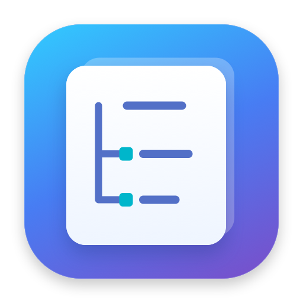

<p align="center">
  
</p>
<h1 align="center">Plip</h1>
<p align="center"><strong>A little editor for your property lists.</strong><br>Native macOS. Apple Silicon. Under 2 MB. No dependencies.</p>
<p align="center">
  <a href="https://github.com/Rodlip/plip-editor/releases/latest"></a>
  <a href="https://github.com/Rodlip/plip-editor/actions/workflows/ci.yml"></a>
  
  
</p>
<p align="center">
  <a href="https://github.com/Rodlip/plip-editor/releases/latest/download/Plip-arm64.pkg"><strong>Download installer</strong></a>
  · <a href="https://github.com/Rodlip/plip-editor/releases/latest/download/Plip-arm64.zip">Portable app</a>
  · <a href="https://github.com/Rodlip/plip-editor/releases">All releases</a>
</p>

---

Plip makes `.plist` files easy to explore and edit. Expand nested dictionaries and arrays, change typed values, and save as XML or binary—all in a small Swift and AppKit application that feels at home on your Mac.

## Made for the Mac

| | |
| :--- | :--- |
| **A clear tree view** | Browse nested keys, types, and values. Filter the tree without losing the surrounding structure. |
| **Every standard plist type** | Dictionaries, arrays, strings, integers, reals, Booleans, dates, and data. |
| **Thoughtful editing** | Validate values, prevent duplicate keys, reorder arrays, and undo or redo changes. |
| **Familiar file handling** | File/Edit menus, native Open and Save dialogs, recent files, and multiple document windows. |
| **Finder integration** | Open `.plist` files with Plip from Finder's **Open With** menu. |
| **Small and local** | No web views, third-party runtime, accounts, telemetry, or network services. Follows the Mac's light or dark appearance. |

## Install

**Requires an Apple Silicon Mac running macOS 13 Ventura or later.**

1. [Download the latest installer](https://github.com/Rodlip/plip-editor/releases/latest/download/Plip-arm64.pkg).
2. Open the `.pkg` and follow the installer. Plip installs in **Applications**.
3. Launch Plip, then open a plist with **File → Open…** or Finder → **Open With → Plip**.

Prefer a drag-and-drop install? [Download the ZIP](https://github.com/Rodlip/plip-editor/releases/latest/download/Plip-arm64.zip), unzip it, and drag **Plip.app** into **Applications**.

> **Signing:** Current releases are ad-hoc signed and are **not Apple-notarized**. macOS may block the first launch of a downloaded copy. After attempting to open it, use **System Settings → Privacy & Security → Open Anyway** if you choose to trust the app. You do not need to disable Gatekeeper.

Each release includes `SHA256SUMS.txt`. To verify a download, run `shasum -a 256` on the file and compare its hash with the matching line in that release's checksum file.

**Make Plip your default:** In Finder, select a plist → **Get Info → Open with → Plip → Change All…**. Installing Plip does not change your existing default. If Finder still shows an old icon, quit the previous copy and launch the updated app from Applications.

## A quick tour

Open the included [Welcome.plist](Examples/Welcome.plist) to try every common value type.

- Select an item and choose **Edit Value**, or double-click its row. Strings preserve whitespace and line breaks.
- **Add Item** adds a child to the selected collection, or a sibling beside a selected value. New documents start with a dictionary; edit **Root** to change its type.
- Use **Edit → Move Item Up / Down** to change array order. Dictionaries require unique keys.
- Dates accept **ISO 8601 with a time zone** and display in UTC. Data is edited as **hexadecimal bytes**, such as `DE AD BE EF`.
- Choose **XML** or **Binary** in the footer, then save. Existing files retain their format until you change it.

| Shortcut | Action |
| :--- | :--- |
| `⌘N` / `⌘O` | New / Open |
| `⌘S` / `⇧⌘S` | Save / Save As |
| `⌘E` | Edit selected item |
| `⌘=` / `⌘D` | Add / Duplicate item |
| `⌘⌫` | Delete selected item |
| `⌘Z` / `⇧⌘Z` | Undo / Redo |
| `⌘F` | Filter keys and values |
| `⌥⌘↑` / `⌥⌘↓` | Move an array item |

Saving rewrites the property list representation: original XML comments, indentation, and dictionary key order are not retained. Keyed archives containing nonstandard UID objects are not supported. Files managed by another application or macOS service may be overwritten by their owner.

## Build it yourself

With Xcode or Apple's Command Line Tools installed:

```sh
git clone https://github.com/Rodlip/plip-editor.git
cd plip-editor
bash Scripts/test.sh
bash Scripts/build.sh --pkg
python3 Scripts/verify-release.py
```

The build explicitly targets `arm64-apple-macos13.0`. There are no packages to download. Outputs go into `dist/`:

| File | Purpose |
| :--- | :--- |
| `Plip.app` | Native application |
| `Plip-<version>-arm64.pkg` | Versioned installer |
| `Plip-arm64.pkg` | Installer with a stable download name |
| `Plip-arm64.zip` | Portable application |
| `SHA256SUMS.txt` | Download checksums |

The test suite covers all value types, XML/binary round trips, input validation, snapshots, document change tracking, and undo/redo. Release verification checks the icon, architecture, signatures, package contents, checksums, and accidental personal identifiers.

## Edit → test → release

**Normal development:** edit the source, run the checks, commit, and push. GitHub Actions tests every push to `main` and every pull request. Successful runs include a downloadable installer artifact, retained for 14 days.

**Publish a version:** update `VERSION` and [release notes](docs/RELEASE-NOTES.md), commit and push, then either:

- Open **Actions → Publish release → Run workflow** on `main`; or
- Tag that commit with the matching version and push the tag—for example, `git tag v1.0.2` followed by `git push origin v1.0.2`.

The release workflow builds and verifies the app, then attaches the PKG, ZIP, and checksums to a GitHub Release. The download links above always point to the latest release. A version must not be reused for another commit. Rerunning the workflow on the same tagged commit refreshes its assets.

See [CONTRIBUTING.md](CONTRIBUTING.md) for the source map, privacy rules, icon regeneration, and signing options.
